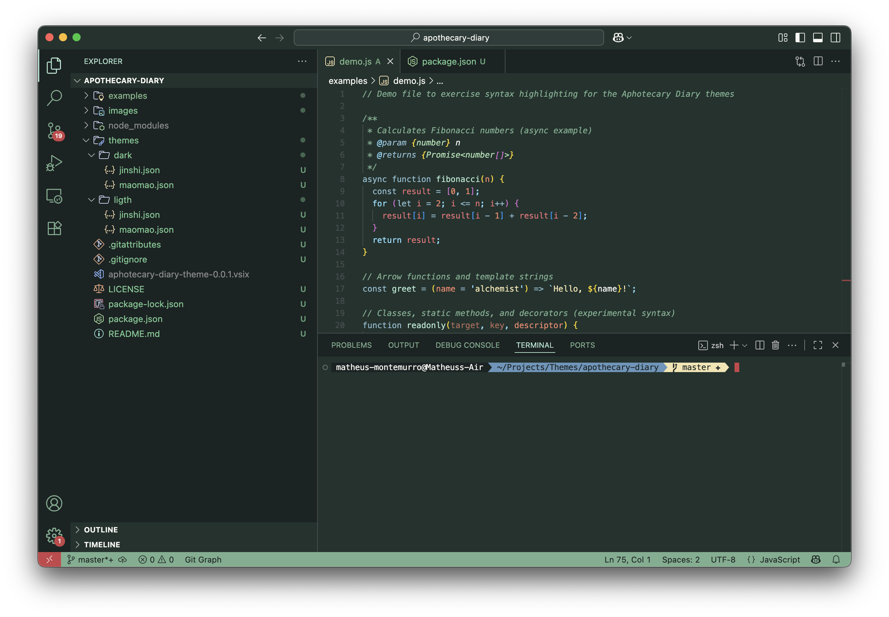
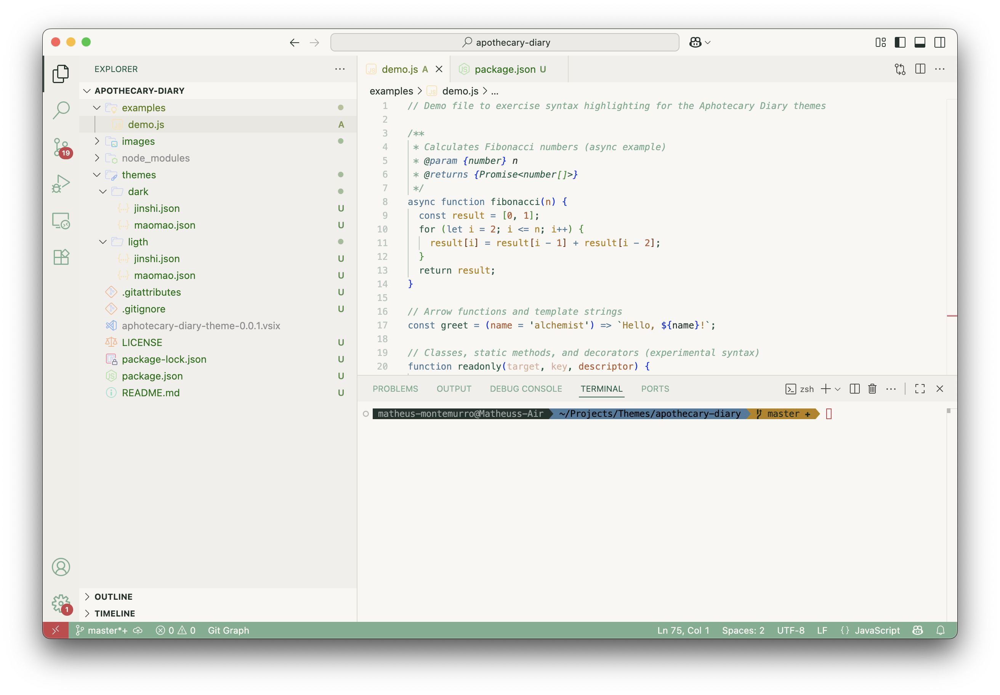
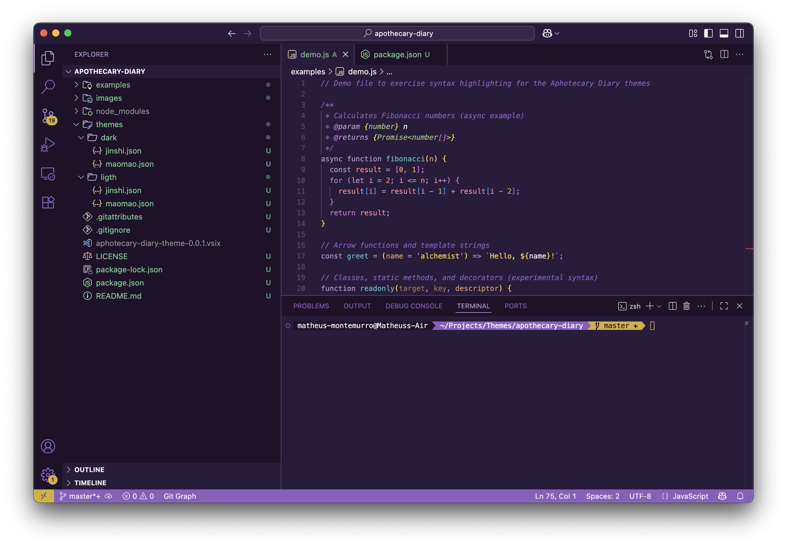
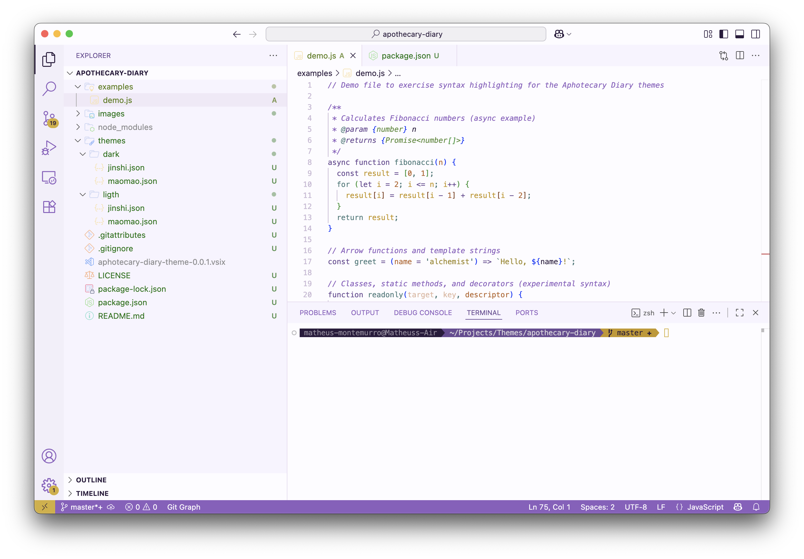

# Aphotecary Diary Theme

Aphotecary Diary VS Code theme

## Theme previews:

- Maomao Dark:

- Maomao Light:

- Jinshi Dark:

- Jinshi Light:

## Install

1. Go to VS Marketplace.  
2. Click on the "Install" button.  
3. Then select a theme. The Aphotecary Diary themes included in this extension:

- Maomao Dark  
- Maomao Light  
- Jinshi Dark  
- Jinshi Light

Additionally, older/legacy variants may be present in the `themes/` folder.

## Override this theme

To override this (or any other) theme in your personal config file, follow the color theme documentation. This is handy for small tweaks to the theme without having to fork and maintain your own theme.

## Contribute

1. Clone and open this repo in VS Code.  
2. Run `npm install` to install dependencies.  
3. Run `npm install:theme` to install themes.  
4. Press F5 to open a new window with your extension loaded.  
5. Open Code > Preferences > Color Theme [⌘K ⌘T] and pick one of the "Aphotecary Diary" themes to test. You may need to pick it twice in the Extension Development Host the first time.  
6. Make changes to the JSON files in `themes/` (the theme files are plain JSON color/token files).

UI changes: for workbench UI colors (status bar, activity bar, side bar, etc.), consult the Theme Color reference.

Syntax changes: for code highlighting, use the Developer: Inspect Editor Tokens and Scopes command from the Command Palette (Ctrl+Shift+P or Cmd+Shift+P on Mac) in the Extension Development Host window.

Build: run `npm run package` to build the VSIX. You can also watch/build automatically if you add a watcher task.

Once you're happy, commit your changes and open a PR.

Note: if possible, prefer using colors from a consistent palette (this repo uses handcrafted palettes in the `themes/` JSON files).

## Publish (maintainers)

Publishing a new version is intended for maintainers.

This repo uses `vsce` for packaging and publishing. The `package.json` includes useful scripts:

- `npm run package` — generates the `.vsix` package via `vsce`.  
- `npm run publish` — publishes the extension to the Marketplace (requires a configured publisher and a Personal Access Token).

Example publish steps (local):

1. Install dev deps: `npm install`
2. Package: `npm run package` (creates `apothecary-diary-theme-<version>.vsix`)
3. (Optional) Install locally: `code --install-extension apothecary-diary-theme-<version>.vsix`
4. Publish: `npm run publish` (requires `vsce` login and PAT configured)

Before publishing, ensure:

- `package.json` has the correct `publisher` field.  
- You have a publisher created on the Marketplace and a PAT configured for `vsce login`.

---

## License

This project is licensed under the MIT License. See the [LICENSE](LICENSE) file for details.
